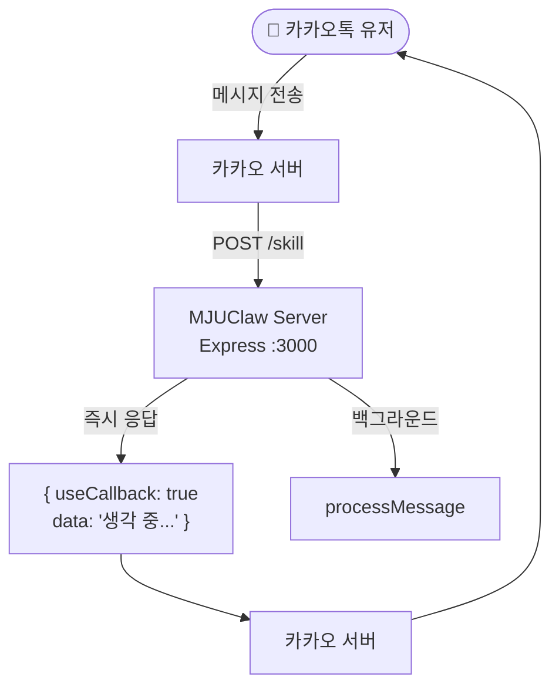
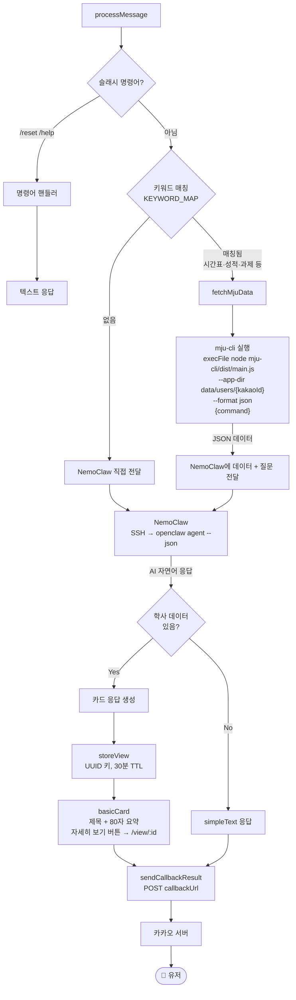
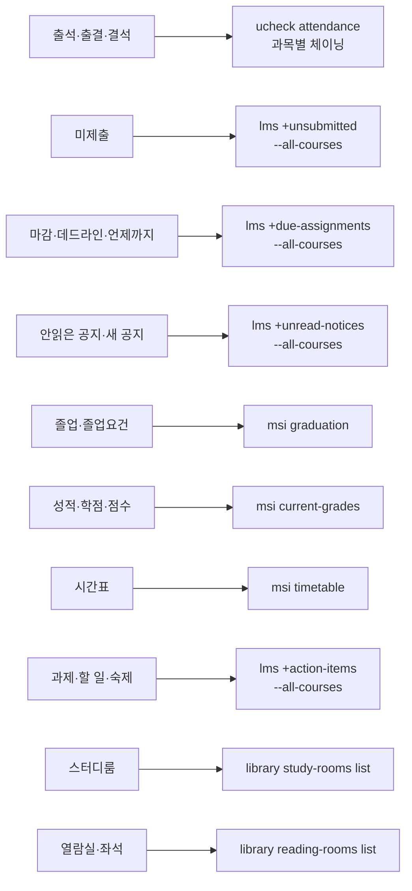
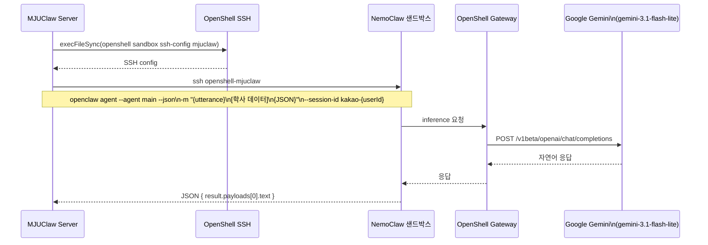
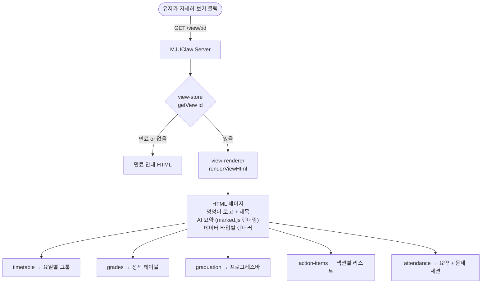
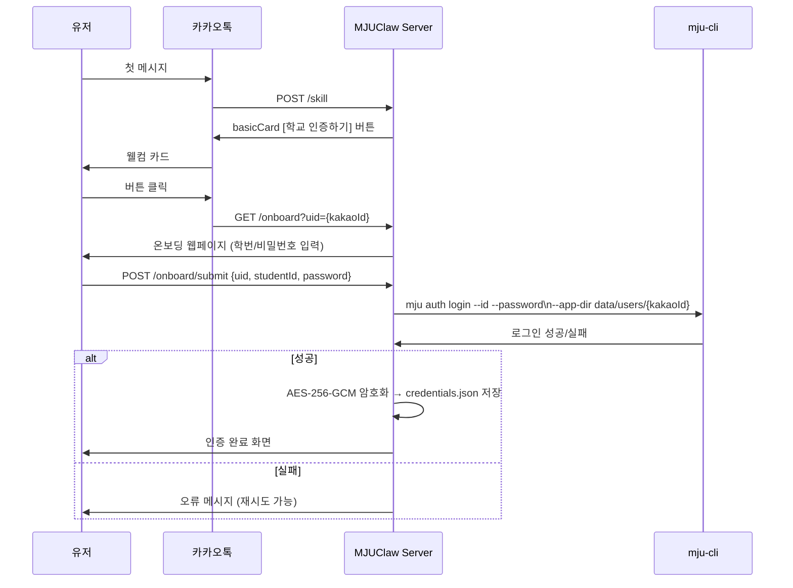
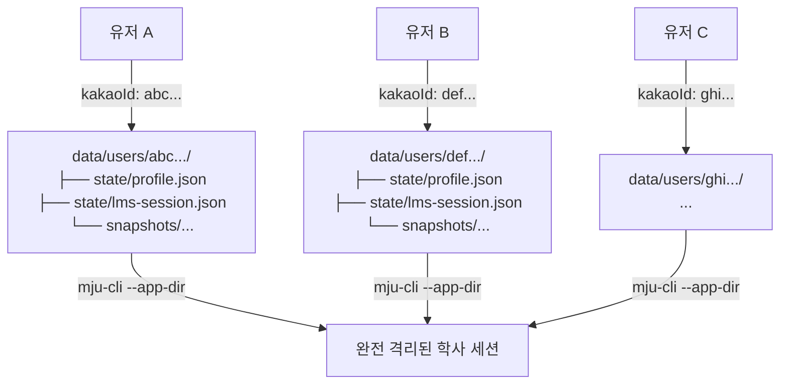

# MJUClaw 서버 플로우 다이어그램

## 전체 메시지 처리 흐름

```mermaid
flowchart TD
    USER([👤 카카오톡 유저]) -->|메시지 전송| KAKAO[카카오 서버]
    KAKAO -->|POST /skill| SERVER[MJUClaw Server\nExpress :3000]

    SERVER -->|즉시 응답| IMMEDIATE["{ useCallback: true\n  data: '생각 중...' }"]
    IMMEDIATE --> KAKAO2[카카오 서버]
    KAKAO2 --> USER

    SERVER -->|백그라운드| PROCESS[processMessage]
```

## 메시지 라우팅

```mermaid
flowchart TD
    PROCESS[processMessage] --> CMD{슬래시 명령어?}

    CMD -->|/reset /help| CMDHANDLER[명령어 핸들러]
    CMDHANDLER --> TEXT_RESP[텍스트 응답]

    CMD -->|아님| KEYWORD{키워드 매칭\nKEYWORD_MAP}

    KEYWORD -->|매칭됨\n시간표·성적·과제 등| MJU[fetchMjuData]
    KEYWORD -->|없음| NEMO_DIRECT[NemoClaw 직접 전달]

    MJU --> MJUCLI["mju-cli 실행\nexecFile node mju-cli/dist/main.js\n--app-dir data/users/{kakaoId}\n--format json\n{command}"]

    MJUCLI -->|JSON 데이터| NEMO_DATA[NemoClaw에 데이터 + 질문 전달]
    NEMO_DIRECT --> NEMO[NemoClaw\nSSH → openclaw agent --json]
    NEMO_DATA --> NEMO

    NEMO -->|AI 자연어 응답| RESULT{학사 데이터\n있음?}

    RESULT -->|Yes| CARD[카드 응답 생성]
    RESULT -->|No| SIMPLETEXT[simpleText 응답]

    CARD --> STORE["storeView\nUUID 키, 30분 TTL"]
    STORE --> BASICCARD["basicCard\n제목 + 80자 요약\n자세히 보기 버튼 → /view/:id"]

    BASICCARD --> CALLBACK[sendCallbackResult\nPOST callbackUrl]
    SIMPLETEXT --> CALLBACK

    CALLBACK --> KAKAO_FINAL[카카오 서버]
    KAKAO_FINAL --> USER_FINAL([👤 유저])
```

## mju-cli 키워드 매핑

```mermaid
flowchart LR
    K1["출석·출결·결석"] --> T1["ucheck attendance\n과목별 체이닝"]
    K2["미제출"] --> T2["lms +unsubmitted\n--all-courses"]
    K3["마감·데드라인·언제까지"] --> T3["lms +due-assignments\n--all-courses"]
    K4["안읽은 공지·새 공지"] --> T4["lms +unread-notices\n--all-courses"]
    K5["졸업·졸업요건"] --> T5["msi graduation"]
    K6["성적·학점·점수"] --> T6["msi current-grades"]
    K7["시간표"] --> T7["msi timetable"]
    K8["과제·할 일·숙제"] --> T8["lms +action-items\n--all-courses"]
    K9["스터디룸"] --> T9["library study-rooms list"]
    K10["열람실·좌석"] --> T10["library reading-rooms list"]
```

## NemoClaw SSH 호출

```mermaid
sequenceDiagram
    participant S as MJUClaw Server
    participant SSH as OpenShell SSH
    participant SB as NemoClaw 샌드박스
    participant G as OpenShell Gateway
    participant AI as Google Gemini\n(gemini-3.1-flash-lite)

    S->>SSH: execFileSync(openshell sandbox ssh-config mjuclaw)
    SSH-->>S: SSH config

    S->>SB: ssh openshell-mjuclaw
    Note over S,SB: openclaw agent --agent main --json\n-m "{utterance}\n[학사 데이터]\n{JSON}"\n--session-id kakao-{userId}

    SB->>G: inference 요청
    G->>AI: POST /v1beta/openai/chat/completions
    AI-->>G: 자연어 응답
    G-->>SB: 응답

    SB-->>S: JSON { result.payloads[0].text }
```

## 웹 뷰 상세 페이지

```mermaid
flowchart TD
    BTN([유저가 자세히 보기 클릭]) -->|GET /view/:id| SERVER[MJUClaw Server]

    SERVER --> STORE{view-store\ngetView id}
    STORE -->|만료 or 없음| EXPIRED[만료 안내 HTML]
    STORE -->|있음| RENDER[view-renderer\nrenderViewHtml]

    RENDER --> HTML["HTML 페이지\n명명이 로고 + 제목\nAI 요약 (marked.js 렌더링)\n데이터 타입별 렌더러"]

    HTML --> TIMETABLE["timetable → 요일별 그룹"]
    HTML --> GRADES["grades → 성적 테이블"]
    HTML --> GRAD["graduation → 프로그레스바"]
    HTML --> ACTIONS["action-items → 섹션별 리스트"]
    HTML --> ATTEND["attendance → 요약 + 문제 세션"]
```

## 온보딩 흐름

```mermaid
sequenceDiagram
    participant U as 유저
    participant K as 카카오톡
    participant S as MJUClaw Server
    participant CLI as mju-cli

    U->>K: 첫 메시지
    K->>S: POST /skill
    S->>K: basicCard [학교 인증하기] 버튼
    K->>U: 웰컴 카드

    U->>K: 버튼 클릭
    K->>S: GET /onboard?uid={kakaoId}
    S->>U: 온보딩 웹페이지 (학번/비밀번호 입력)

    U->>S: POST /onboard/submit {uid, studentId, password}
    S->>CLI: mju auth login --id --password\n--app-dir data/users/{kakaoId}
    CLI->>S: 로그인 성공/실패

    alt 성공
        S->>S: AES-256-GCM 암호화 → credentials.json 저장
        S->>U: 인증 완료 화면
    else 실패
        S->>U: 오류 메시지 (재시도 가능)
    end
```

## 유저별 데이터 격리

```mermaid
flowchart TD
    U1[유저 A] -->|kakaoId: abc...| DIR1["data/users/abc.../\n├── state/profile.json\n├── state/lms-session.json\n└── snapshots/..."]
    U2[유저 B] -->|kakaoId: def...| DIR2["data/users/def.../\n├── state/profile.json\n├── state/lms-session.json\n└── snapshots/..."]
    U3[유저 C] -->|kakaoId: ghi...| DIR3["data/users/ghi.../\n..."]

    DIR1 & DIR2 & DIR3 -->|mju-cli --app-dir| ISOLATED[완전 격리된 학사 세션]
```
